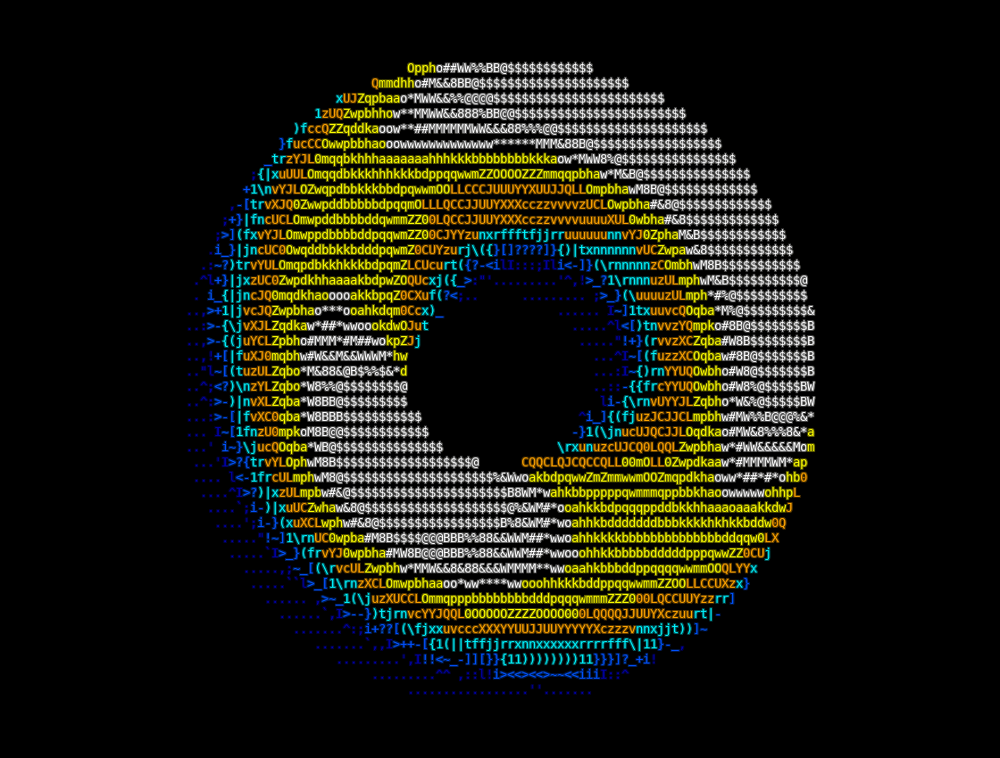

# enhanced-spinning-donut

messing around with 3d ascii graphics in the terminal

pure python + numpy, no graphics library

---

So at first, I just wanted to replicate the famous spinning donut but I tried to put in some other shapes and I pushed it a little.

## what it does

4 shapes, all built from their parametric equations:

- torus
- cube
- möbius strip
- sphere

2 animations :

- rotation : the shape spins on its three axes
- light sweep : the shape is still, the light turns around it

And between two shapes :

- interpolation : every point of the current shape moves in a straight line to the matching point of the next one

The whole cycle repeats with four different ascii brightness palettes and three colour palettes, 12 combinations total.

## how it works (roughly)

Every shape is sampled on a 2d grid of angles. Each sample gives a 3d point and a normal vector pointing outward. The normals do the heavy lifting:

- only points whose normal points toward the camera are kept and shown. Points on the back of the shape are skipped.
- to get the lighting and colour right, I used Lambert's law, `I = I0 · cos(α)`, where `cos(α)` is the dot product between the point's normal and the light direction
- several points can project onto the same screen cell, so we keep only the nearest one.
- each point paints a small 2×2 block of cells, not just one. Otherwise you can see through the surface where the sampling is less dense. However, this makes the shading and the shape of the objects blockier, less smooth.

The rotation is a 3×3 matrix composed of three axis rotations, applied to the whole shape at once.

## things i learned doing this

- how to read a parametric definition of a surface and turn it directly into code
- the möbius strip is the only one where the normal isn't obvious. I had to take the cross product of the two tangent vectors
- in the terminal, a character is twice as tall as it is wide, that's why the y-axis gets halved in the projection. It took me a while to figure out why everything looked stretched.

## a note on the ansi codes

The terminal stuff (clearing the screen, moving the cursor, hiding it, the 256-colour codes) is mostly code I picked up here and there online. The part I focused on was the math and the rendering, so voilà.

## todo maybe

- making the surfaces more reflective
- try and manage multiple light sources with different colors
- more shapes
- try to render an obj but I fear the resolution would be too low
- maybe trying to understand more the terminal manipulation stuff
